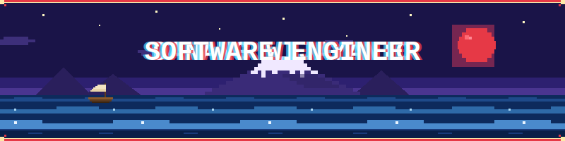

  
  

  ---

#### 🏢 Experiences
<table align="center">
  <tr>
    <th>Role</th>
    <th>Company</th>
    <th>Duration</th>
  </tr>
  <tr>
    <td>Software Engineer</td>
    <td><a href="https://www.rivoltatech.com/">Rivolta Solusi Teknologi</a></td>
    <td>Jan 2026 – Now</td>
  </tr>
  <tr>
    <td>Software Engineer Intern</td>
    <td><a href="https://www.rivoltatech.com/">Rivolta Solusi Teknologi</a></td>
    <td>Oct 2025 – Jan 2026</td>
  </tr>
  
  <tr>
    <td>Full Stack Developer Intern</td>
    <td><a href="https://lldikti5.kemdiktisaintek.go.id">LLDIKTI Wilayah V</a></td>
    <td>Sep 2024 – Dec 2024</td>
  </tr>
  
</table>

---

<b>Skills</b>

<h4 style= "margin-top: 30px; border: none">Languages</h4>

<h4 style= "margin-top: 30px; border: none">Libraries & Frameworks</h4>

<h4 style= "margin-top: 30px; border: none">Databases</h4>

<h4 style= "margin-top: 30px; border: none">Tools and Others</h4>

